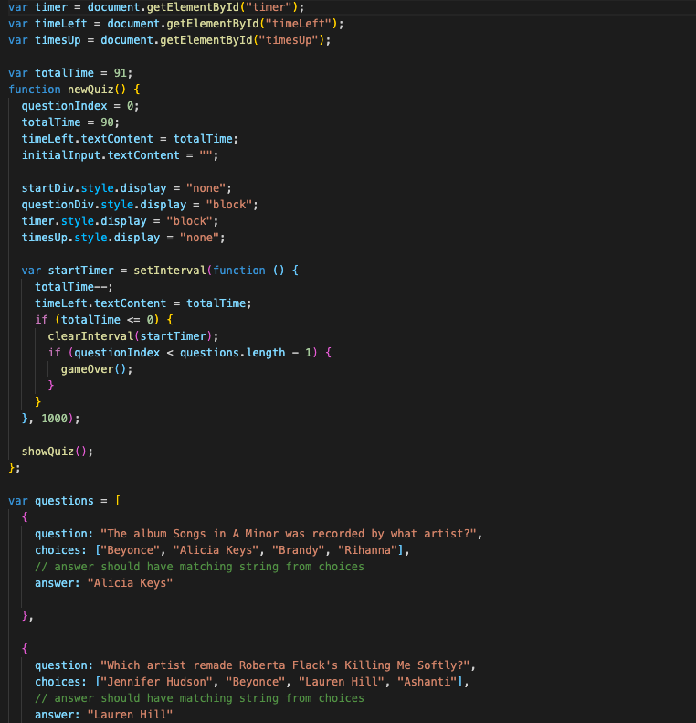
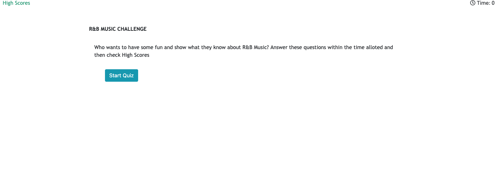

# Quiz-Game
Multi quiz game that will keep score and includes a timer option 

# Code Snippet 

# Sources
Referred to previous homework with sample code to get started. 
https://www.w3schools.com/html/html_links.asp used to understand linking pages in html
Homework 2 used for adding bootstrap and understanding placement of the game within a card on the screen 
https://www.w3schools.com/js/js_timing.asp (had some challenges with figuring out the timer)
https://www.w3schools.com/howto/howto_js_countdown.asp

